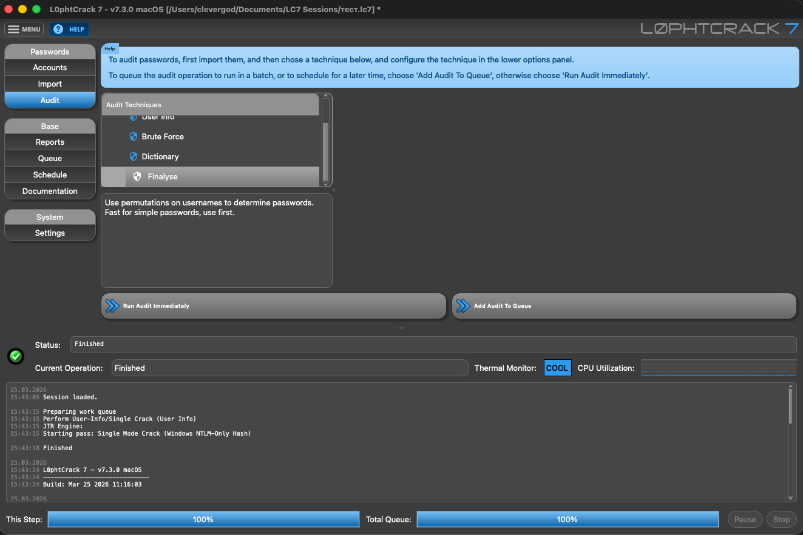

# L0phtCrack 7 — macOS Apple Silicon Fork

> A community fork of [L0phtCrack 7](https://gitlab.com/l0phtcrack/l0phtcrack) bringing full macOS support with Apple Silicon GPU acceleration via **hashcat**.


-green)




---

## About

L0phtCrack is a classic password auditing and recovery tool, originally created by the legendary hacker collective **L0pht Heavy Industries** and later developed by **L0pht Holdings, LLC**. For years it was the industry standard for Windows password auditing. The original product — available at [gitlab.com/l0phtcrack/l0phtcrack](https://gitlab.com/l0phtcrack/l0phtcrack) — was Windows-only and is no longer actively maintained.

**We are grateful to the original L0phtCrack team** for the years of work put into this product. This fork takes their open-sourced codebase as a foundation and brings it fully to macOS on Apple Silicon.

---

## What's different in this fork

### Engine: hashcat instead of John the Ripper

The original L0phtCrack used John the Ripper as its cracking engine. On macOS Apple Silicon this engine was slow and incompatible. This fork **replaces John the Ripper with [hashcat](https://hashcat.net/hashcat/)**, which:

- Uses the **Apple Metal GPU** for full hardware acceleration (M1/M2/M3/M4)
- Finds **2–3× more passwords** in User Info mode compared to the original Windows JtR binary
- Supports all major attack modes: Brute Force, Dictionary, and User Info (single)
- Runs at full GPU speed — benchmarks show NTLM cracking at multi-GH/s on Apple Silicon

### Finalyze technique

Added the **Finalyze** attack technique, which takes already-cracked passwords and runs them through an additional rule set (`buka_400k`). This allows recovering more passwords from hashes where a simple variation of a known password was used — a common real-world scenario.

### Color scheme support

Added the ability to change the application color scheme in Settings. Switch between dark and light themes to suit your preference.

### macOS-native build

- Full `macdeployqt` bundle — all Qt frameworks packaged inside `.app`
- No external dependencies beyond hashcat (installable via Homebrew)
- Proper RPATHs, code signing compatible, tested on macOS 13 Ventura and 14 Sonoma

---

## Requirements

| Requirement | Details |
|-------------|---------|
| macOS | 13 Ventura or newer |
| Architecture | Apple Silicon (M1 / M2 / M3 / M4) |
| hashcat | 7.x — install via `brew install hashcat` |

---

## Installation

### Option 1 — Download pre-built app (recommended)

1. Go to [Releases](https://github.com/cleverg0d/l0phtcrack/releases) and download `lc7-vX.Y.Z-macos-arm64.zip`
2. Unzip the archive
3. Drag `lc7.app` to your **Applications** folder
4. Install hashcat: `brew install hashcat`
5. Open `lc7.app`

> First launch may require right-click → Open to bypass Gatekeeper on unsigned builds.

### Option 2 — Build from source

```bash
# Prerequisites
brew install cmake qt@5 quazip openssl hashcat

# Clone
git clone https://github.com/cleverg0d/l0phtcrack.git
cd l0phtcrack

# Configure & build
mkdir build-macos && cd build-macos
cmake .. -DCMAKE_BUILD_TYPE=Release -DCMAKE_PREFIX_PATH=$(brew --prefix qt@5)
make -j$(sysctl -n hw.logicalcpu)

# Package
macdeployqt dist/lc7.app
```

---

## Supported attack modes

| Mode | Description |
|------|-------------|
| **Brute Force** | Fast / Standard / Extended — uses hashcat `?a` incremental mask, Metal GPU |
| **Dictionary** | Wordlist attack with optional rules (best64, buka_400k, custom) |
| **User Info** | Generates password candidates from usernames and full names; finds passwords like `Firstname123`, `lastname@2024`, etc. |
| **Finalyze** | Post-crack rule pass — derives additional passwords from already-found ones |

---

## Planned features

1. Adapted UI for a more comfortable modern macOS look and feel
2. ~~CPU load and temperature monitoring for Apple M-series processors~~ ✅ Done in v7.3.1
3. Summary view of recovered passwords
4. Pie chart: cracked vs. uncracked accounts, duplicate password detection, percentage of active (non-disabled) accounts cracked
5. Linux x86-64 release
6. Benchmark improvements
7. ~~Additional attack techniques and improvements~~ ✅ Done in v7.3.2 — folder wordlist mode, custom hashcat rule file per attack, Finalise all-rules sequential mode

---

## Credits

- **L0phtCrack 7** — original product by L0pht Holdings, LLC and the L0pht lineage. Original source: [gitlab.com/l0phtcrack/l0phtcrack](https://gitlab.com/l0phtcrack/l0phtcrack)
- **hashcat** — [hashcat.net](https://hashcat.net/hashcat/) by atom and contributors
- **Qt** — [qt.io](https://www.qt.io/)

---

## Legal

This tool is intended for **authorized password auditing only**. Use only on systems and accounts you own or have explicit written permission to test. Unauthorized use is illegal.

This fork is provided under the same license terms as the upstream project (see `LICENSE.MIT` / `LICENSE-2.0.APACHE.txt`).
